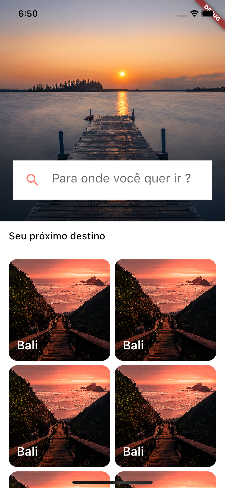
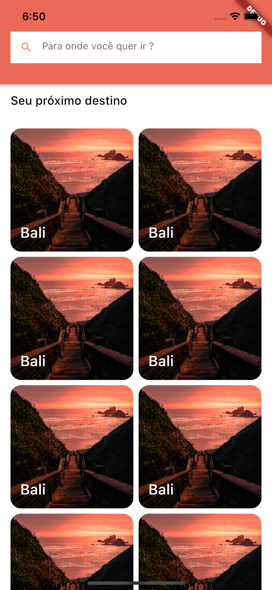

# App Bar customizada

Esse projeto é um desafio onde é construído um app com uma listagem um app bar customizado.

| Expandido | Colapsado |
| --- | --- |
|  |  |

## Descrição

Desafio é de criar um app capaz de listar seu conteúdo em grade, e mudar o formato da sua barra superior de acordo com o scroll do usuário.

  

  

  

  